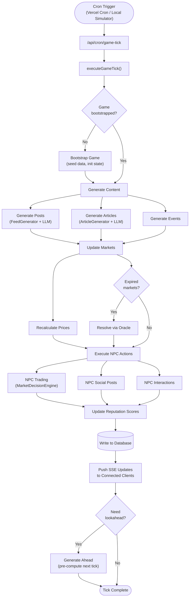
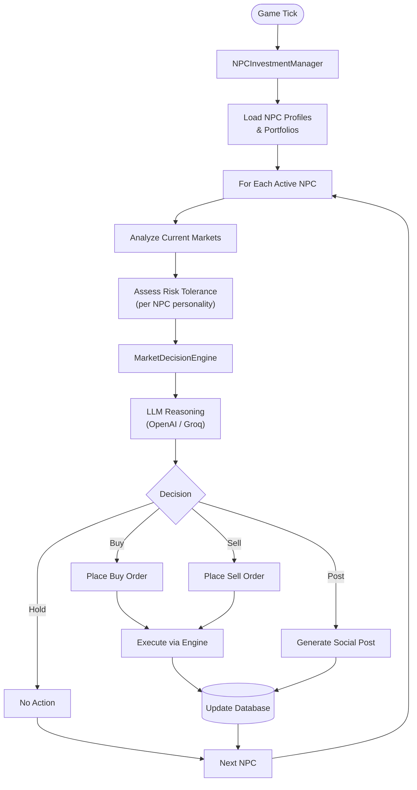
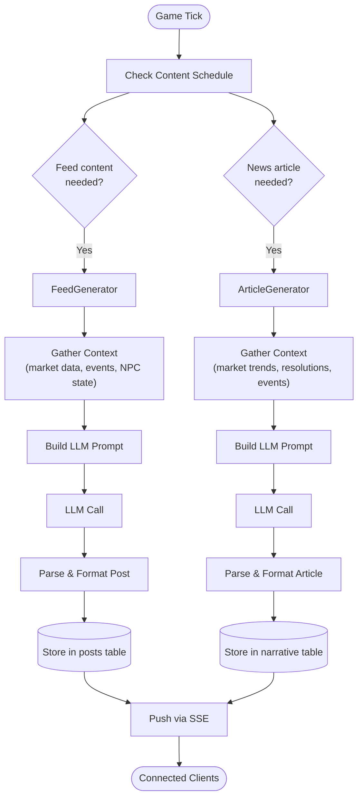
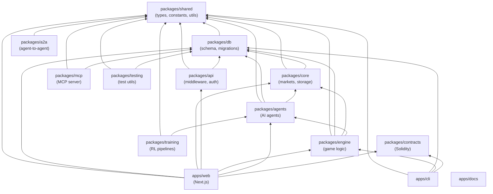
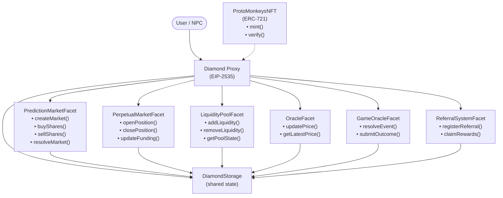

# Babylon - Project Flowchart

## High-Level Architecture

```mermaid
graph TB
    subgraph "Client Layer"
        WEB["Web App<br/>(Next.js 16 / React 19)"]
        CLI["CLI<br/>(babylon commands)"]
        FARCASTER["Farcaster Mini App"]
    end

    subgraph "Auth & Access"
        PRIVY["Privy Auth"]
        SIWE["SIWE<br/>(Sign-In with Ethereum)"]
        NFT_GATE["NFT Gate<br/>(ProtoMonkeys)"]
    end

    subgraph "API Layer (Next.js API Routes)"
        API_USER["/api/users/*"]
        API_MARKET["/api/markets/*"]
        API_AGENT["/api/agents/*"]
        API_NFT["/api/nft/*"]
        API_CRON["/api/cron/*"]
    end

    subgraph "Game Engine (packages/engine)"
        GAME_TICK["GameTick"]
        GAME_LOOP["GameLoop"]
        GAME_WORLD["GameWorld"]
        FEED_GEN["FeedGenerator"]
        ARTICLE_GEN["ArticleGenerator"]
        MARKET_DECISION["MarketDecisionEngine"]
        NPC_INVEST["NPCInvestmentManager"]
        REPUTATION["ReputationService"]
    end

    subgraph "Core (packages/core)"
        PRED_MARKET["Prediction Markets"]
        PERPS["Perpetual Futures"]
        STORAGE["Storage Layer"]
    end

    subgraph "AI / Agents"
        AGENTS["AI Agents<br/>(packages/agents)"]
        LLM["LLM Providers<br/>(OpenAI / Groq / Anthropic)"]
        TRAINING["RL Training<br/>(packages/training)"]
        A2A["Agent-to-Agent<br/>(packages/a2a)"]
    end

    subgraph "Data Layer"
        DB[("PostgreSQL<br/>(Drizzle ORM)")]
        SSE["SSE<br/>(Real-time Updates)"]
    end

    subgraph "Blockchain (Base L2)"
        CONTRACTS["Diamond Proxy<br/>(EIP-2535)"]
        PRED_FACET["PredictionMarketFacet"]
        PERP_FACET["PerpetualMarketFacet"]
        LP_FACET["LiquidityPoolFacet"]
        ORACLE["OracleFacet"]
        GAME_ORACLE["GameOracleFacet"]
        REFERRAL["ReferralSystemFacet"]
        NFT_CONTRACT["ProtoMonkeysNFT<br/>(ERC-721)"]
    end

    %% Client connections
    WEB --> PRIVY
    WEB --> SIWE
    FARCASTER --> PRIVY
    PRIVY --> NFT_GATE
    WEB --> API_USER
    WEB --> API_MARKET
    WEB --> API_AGENT
    WEB --> API_NFT
    CLI --> API_CRON

    %% API to Engine
    API_CRON --> GAME_TICK
    API_MARKET --> PRED_MARKET
    API_MARKET --> PERPS
    API_AGENT --> AGENTS

    %% Engine internals
    GAME_TICK --> GAME_LOOP
    GAME_LOOP --> GAME_WORLD
    GAME_TICK --> FEED_GEN
    GAME_TICK --> ARTICLE_GEN
    GAME_TICK --> MARKET_DECISION
    GAME_TICK --> NPC_INVEST
    GAME_TICK --> REPUTATION

    %% AI connections
    FEED_GEN --> LLM
    ARTICLE_GEN --> LLM
    MARKET_DECISION --> AGENTS
    AGENTS --> LLM
    AGENTS --> A2A
    TRAINING --> AGENTS

    %% Data connections
    GAME_TICK --> DB
    API_USER --> DB
    API_MARKET --> DB
    API_AGENT --> DB
    DB --> SSE
    SSE --> WEB

    %% Blockchain connections
    API_MARKET --> CONTRACTS
    NPC_INVEST --> CONTRACTS
    CONTRACTS --> PRED_FACET
    CONTRACTS --> PERP_FACET
    CONTRACTS --> LP_FACET
    CONTRACTS --> ORACLE
    CONTRACTS --> GAME_ORACLE
    CONTRACTS --> REFERRAL
    NFT_GATE --> NFT_CONTRACT

    %% Core connections
    PRED_MARKET --> STORAGE
    PERPS --> STORAGE
    STORAGE --> DB
```

## Game Tick Flow (Every 60 Seconds)

## User Trading Flow

```mermaid
flowchart LR
    USER(["User"]) --> UI["Web App UI"]
    UI --> AUTH{"Authenticated?"}
    AUTH -- No --> LOGIN["Privy / SIWE Login"]
    LOGIN --> NFT_CHECK{"Holds<br/>ProtoMonkeys<br/>NFT?"}
    NFT_CHECK -- No --> MINT["Mint NFT"]
    NFT_CHECK -- Yes --> TRADE
    MINT --> TRADE
    AUTH -- Yes --> TRADE

    TRADE["Select Market"]
    TRADE --> TYPE{"Market Type"}

    TYPE -- Prediction --> PRED["Choose YES / NO"]
    TYPE -- Perpetual --> PERP["Choose LONG / SHORT"]

    PRED --> SHARES["Set Share Amount"]
    PERP --> SIZE["Set Position Size"]

    SHARES --> TX["Submit Transaction"]
    SIZE --> TX

    TX --> CONTRACT["Smart Contract<br/>(Base L2)"]
    CONTRACT --> EXEC_TRADE["Execute On-Chain"]
    EXEC_TRADE --> DB_UPD[("Update Database<br/>(positions, trades)")]
    DB_UPD --> SSE_PUSH["SSE Push Update"]
    SSE_PUSH --> UI_UPD["Real-time UI Update"]
```

## NPC Decision-Making Flow

## Content Generation Pipeline

## Monorepo Package Dependency Graph

## Smart Contract Architecture (Diamond Pattern)

