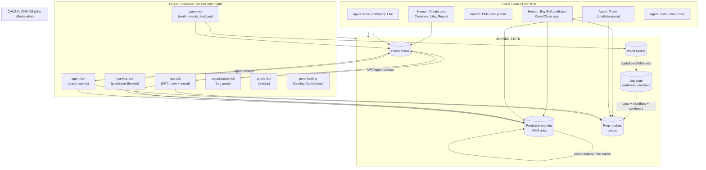
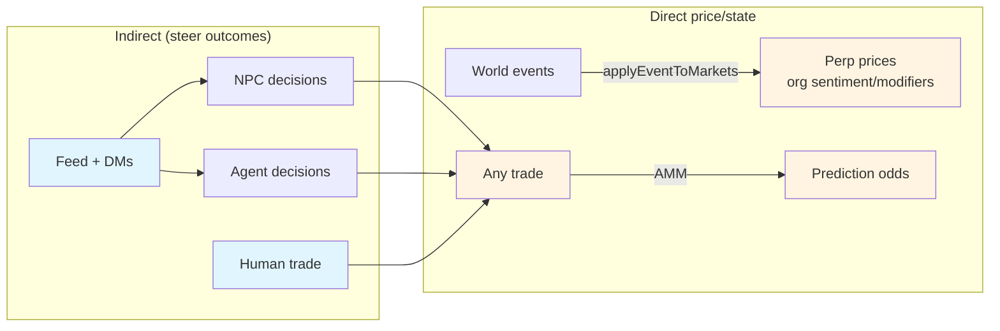

# Babylon: Systems, User Inputs & How They Interact

Diagram of **what user/agent inputs exist**, **how systems interact**, and **how inputs can indirectly steer outcomes** (e.g. social → NPC behavior → markets).

---

## 1. High-level flow (Mermaid)



---

## 2. User & agent inputs (what can “steer”)

| Input | Who | Effect |
|-------|-----|--------|
| **Trade (prediction)** | Human, Agent | Buys/sells YES/NO → AMM odds change **directly** |
| **Trade (perp)** | Human, Agent | Opens/closes long/short → position flow; perp **price** comes from org state (events), not from order book |
| **Create post** | Human, Agent | Adds to feed → **indirect**: NPCs/agents read feed → may trade → moves prediction odds / perp flow |
| **Comment, Like, Repost** | Human, Agent | Engagement on feed → visibility/signals → **indirect**: influences what others see and how NPCs/agents react |
| **DM / Group message** | Human, Agent | “Insider” context for NPC/agent decisions → **indirect**: can lead to trades (info-trader archetype) |
| **Pool deposit/withdraw** | Human | Affects pool AUM; pool NPC trades → **indirect** market flow |

**No direct path:** Post content or sentiment is **not** piped into prediction AMM or perp price formulas. Only **trades** move prediction odds; only **events** (via `applyEventToMarkets`) and org state move perp prices.

---

## 3. How systems interact (causal summary)



- **Prediction markets:** Odds = f(yesShares, noShares). Only **trades** (human, agent, NPC) change shares → **user/agent trading directly steers**; **posts/DMs steer only by influencing who trades**.
- **Perp markets:** Price = f(basePrice, org sentiment, event-driven modifiers). **User posts do not write to this.** Events (from narrative/arcs) → `applyEventToMarkets` → modifiers/sentiment → price. **User/agent can steer** only by **trading** (flow) and by **indirectly affecting narrative** only if there were a future path from feed into event generation (currently there is not).

---

## 4. Does X affect Y? (social, perps, prediction)

X = row, Y = column. **Direct** = X is an input to the formula/state that defines Y. **Indirect** = X influences behavior or context that then changes Y (e.g. feed → NPC decisions → trades).

### Weight scale (0–3)

| Weight | Meaning |
|--------|--------|
| **3** | Strong: direct causal path or dominant input to Y. |
| **2** | Medium: clear indirect path or one of several important inputs. |
| **1** | Weak: indirect only, diluted by other signals or rare. |
| **0** | None: no causal path. |

### Weighted matrix (X → Y)

|  | **Social** | **Perps** | **Prediction** |
|--|------------|-----------|----------------|
| **Social** | **3** — Posts, comments, likes, DMs *are* social; feed is social state. | **1** — Indirect. Feed + DMs in NPC/agent context → trades → perp flow only; no price impact. One of several context signals. | **1** — Indirect. Same path (feed/DMs → decisions → prediction trades). AMM moves only when they trade. |
| **Perps** | **2** — Indirect. Perp state (prices, significant moves) is input to world events and feed context; narrative and posts reference perps. | **3** — Trading updates positions and flow; funding/liquidations; prices from org state + events (perps don’t “set” own price from order flow, but perp *system* state is driven by events + trading). | **0** — No direct. Prediction odds = AMM only. **1** if we count “same actor sees perp in context and may trade prediction” as indirect. |
| **Prediction** | **2** — Indirect. Resolved questions, prediction topics, event–market links in narrative; feed and articles reference prediction markets. | **0** — No path. Perp prices from event-market-pipeline (org state), not from prediction AMM. | **3** — Trades move YES/NO shares → AMM odds change directly. |

### Same matrix, numeric only (for quick scan)

|  | Social | Perps | Prediction |
|--|--------|-------|------------|
| **Social** | 3 | 1 | 1 |
| **Perps** | 2 | 3 | 0 (1 indirect) |
| **Prediction** | 2 | 0 | 3 |

### Prose summary (unchanged)

|  | **Social** | **Perps** | **Prediction** |
|--|------------|-----------|----------------|
| **Social** | **Yes.** Posts, comments, likes, reposts, DMs *are* social and shape feed/engagement. | **Indirect.** Feed + DMs are context for NPC/agent trading → they can trade perps → flow changes. Social does **not** set perp prices (events + org state do). | **Indirect.** Same: feed + DMs → NPC/agent decisions → they trade prediction markets → AMM odds change. Social does **not** directly update AMM. |
| **Perps** | **Indirect.** Perp prices and moves are in market state; world events and feed generation use that state (e.g. “significant moves”) and narrative references perps, so perp state influences what gets posted. | **Yes.** Trading updates positions; funding/liquidations run; prices come from org state + events (not from social). | **No direct.** Prediction odds are AMM from prediction trades only. Same actors may trade both (so perp context can indirectly influence their prediction trades via NPC/agent context). |
| **Prediction** | **Indirect.** Resolved questions, prediction topics, and event–market links are in narrative/context; feed and articles reference prediction markets. | **No direct.** Perp prices come from event-market-pipeline (org state), not from prediction AMM. | **Yes.** Trades in prediction markets move YES/NO shares → AMM odds change directly. |

**Short answers:**

- **Does social affect perps?** Indirect only, weight **1** (social → NPC/agent trades → perp flow). Not price.
- **Does social affect prediction?** Indirect only, weight **1** (social → NPC/agent trades → prediction odds).
- **Does perps affect social?** Indirect, weight **2** (perp state in context → events/feed mention perps).
- **Does perps affect prediction?** No direct (weight **0**); weak indirect (weight **1**) if same actors trade both.
- **Does prediction affect social?** Indirect, weight **2** (prediction state in context → feed/narrative reference it).
- **Does prediction affect perps?** No path; weight **0** (perp prices from events/org state).

---

## 5. Cron roles

| Cron | Role |
|------|------|
| **game-tick** | World state, world events, feed generation (NPC posts from events), triggers markets-tick + npc-tick |
| **markets-tick** | Prediction market lifecycle: create/resolve/settle questions, replace markets |
| **npc-tick** | NPCs: read feed + context → trading decisions + social (posts, likes, comments) |
| **agent-tick** | Player agents: dashboard (feed, markets, portfolio) → trade / post / comment / DM |
| **organization-tick** | Org posts (e.g. company announcements) |
| **article-tick** | Long-form articles from events |
| **perp-funding** | Funding rate steps, liquidations |

Events that affect perp prices are produced in **game-tick** (narrative/arcs) and applied in **narrative-event-processor** via `applyEventToMarkets`.

---

## 6. Levers by outcome (end users only)

“X” = the thing you care about (e.g. an org/ticker, a person/actor, a prediction market, or a topic). **Levers** = actions **you** can take as a player (no admin or system levers). Grouped by outcome.

**End-user levers:** post, comment, like, repost (share), DM, group message, buy/sell prediction, open/close perp, pool deposit/withdraw.

---

### Change **social sentiment** about X  
*(tone of feed about X, how X is talked about)*

| Lever | How it works |
|-------|----------------|
| **Post about X** | Your post appears in the feed; NPCs and agents see it as “recent developments” / “current focus” and can react or trade based on it. |
| **Comment on posts about X** | Adds to the thread; can reinforce or counter the narrative. |
| **Like / repost** | Boosts visibility of that post; affects what’s prominent in the feed and what others (and NPCs/agents) see. |
| **DM / group message** | Private context that NPCs/agents may treat as “insider” signal; can reference X and influence their trading or behavior. |
| **Mention X (if X is an actor)** | Mentioning an actor in a post can boost that actor’s response probability in NPC logic (implicit when you post). |

---

### Change **price** of X  
*(X = perp ticker/org; the quoted perp price)*

**As an end user you cannot change the perp price of X.**  
Price is set by the system (base + org sentiment + event-driven modifiers). Your **trading** only changes **positions and flow** (who’s long/short, PnL), not the mark price.

| Lever | Effect |
|-------|--------|
| **Open/close perp on X** | Updates your (and market) positions and volume; does **not** move the quoted price of X. |

---

### Change **bidding** on X  
*(X = prediction market; YES/NO volume and odds)*

| Lever | How it works |
|-------|----------------|
| **Buy/sell prediction on X** | Buy YES or NO, or sell your position. Directly moves AMM shares → odds on X change. |
| **Influence NPCs/agents to trade X** | Post, comment, or DM so they see narrative about X; they may then trade that market (and side/size), which moves odds. |

You cannot create, resolve, or cancel prediction markets; that’s system/admin.

---

### Other outcomes (end-user levers only)

| Outcome | Levers you have |
|--------|------------------|
| **What’s in the feed / visibility** | Post, comment, like, repost. |
| **NPC–user relationships** | Your engagement (comments, likes, DMs) feeds into relationship evolution (system runs it; you only supply the interactions). |
| **Reputation / points** | Trading and engagement, per the game’s points rules. |
| **Pool AUM** | Pool deposit/withdraw (pool performance also depends on pool NPC trades, which you don’t control). |
| **Perp flow (positions)** | Open/close perp positions. |
| **Agent behavior** | If you own an agent: enable/disable, goals, config (dashboard/settings). |

---

### One-page lever → outcome (end users only)

| Goal | Levers you can pull |
|------|----------------------|
| **Social sentiment about X** | Post, comment, like, repost, DM; mention X (if actor). |
| **Price of X (perp)** | None. (You only affect positions/flow.) |
| **Bidding on X (prediction)** | Buy/sell on X; influence NPCs/agents via post, comment, DM. |
| **Feed visibility** | Post, comment, like, repost. |
| **Relationships** | Comment, like, DM (your engagement is the input). |
| **Reputation / points** | Trading, engagement. |
| **Pool AUM** | Pool deposit/withdraw. |
| **Perp positions** | Open/close perp. |

---

## 7. One-page visual (ASCII)

```
┌─────────────────────────────────────────────────────────────────────────────┐
│                         USER / AGENT INPUTS                                  │
│  • Trade (prediction buy/sell, perp open/close)  • Post, comment, like       │
│  • DM, group chat                               • Pool deposit/withdraw     │
└─────────────────────────────────────────────────────────────────────────────┘
     │                    │                    │
     ▼                    ▼                    ▼
┌──────────┐      ┌──────────────┐      ┌─────────────┐
│ Prediction│      │    FEED      │      │ Perp flow   │
│  AMM      │      │  (posts)     │      │ (positions) │
│ odds      │      └──────┬───────┘      └──────┬──────┘
│ ▲         │             │                     │
│ │ trades  │             │ read as context     │ trades
│ │         │             ▼                     │
│ │    ┌────┴────┐   ┌─────────┐   ┌──────────┐ │
│ └────┤  NPC &  ├───┤ agent-  ├───┤ npc-tick │─┘
│      │ Agent   │   │ tick    │   │          │
│      │ trades  │   └────┬────┘   └────┬─────┘
│      └────┬────┘        │             │
│           │             │             │
│           └─────────────┴─────────────┘
│                 (indirect: feed → decisions → trades)
│
│  Perp PRICES (not flow) come from:
│    World events → applyEventToMarkets → org sentiment/modifiers → price
│    (No feed → price path.)
└─────────────────────────────────────────────────────────────────────────────┘
```

---

## 8. Summary

- **User inputs** that exist: trade (prediction + perp), post, comment, like, repost, DM, group chat, pool deposit/withdraw.
- **Direct steering:** Trading moves **prediction odds** (AMM) and **perp flow** (positions); it does **not** set perp price (events + org state do).
- **Indirect steering:** **Posts, comments, likes, DMs** enter the **feed and messaging context** that **NPCs and agents** use to decide **whether and how to trade**. So social input can steer **outcomes** by changing NPC/agent behavior, which then changes prediction odds and perp flow.
- **No direct path:** Social content is not an input to prediction AMM math or to perp price (event-market-pipeline). Events → perp prices; trades → prediction odds; feed → only NPC/agent decisions → trades.

---

## 9. NPC trading prompt in depth: what signals it focuses on

The prompt that drives **indirect steering** (feed/DMs → NPC decisions → trades) is the **NPC market decisions** prompt (`npc-market-decisions`, rendered in `MarketDecisionEngine`). Below is what actually gets injected and what the model is told to use.

### 9.1 Prompt layout (template variables)

| Variable | Source | What it contains |
|----------|--------|-------------------|
| **realityGrounding** | `generateWorldContext({ realityGroundingLevel: 'minimal' })` | Current date/time, minimal world grounding text. |
| **characterRoster** / **detailedCharacterProfiles** | Optional; not passed by MarketDecisionEngine | Often empty in trading path. |
| **richGameContext** | `generateWorldContext()` (optional) | Optional narrative; usually `''` unless causal sim sets it. |
| **resolvedQuestionsContext** / **ongoingNarrativesContext** | Optional; not passed by MarketDecisionEngine | Often empty. |
| **marketTable** | From first NPC’s context | ASCII table: perp tickers (price, 24h change, volume), prediction markets (YES/NO price, volume). |
| **activeQuestions** | Cached active prediction questions | List of active question texts + “resolves in N days”. |
| **recentEvents** | **Actor posts (feed), last 24h** | Formatted as “Recent developments (last 24h): - ActorName: content…” (content truncated to 100 chars). So **feed posts are the main “events” narrative** here. |
| **eventMarketSignals** | `EventMarketLinkerService.getMarketEventSummaries(24)` | **World events** (from DB) linked to prediction markets: question snippet, direction (↑ YES / ↓ NO / → NEUTRAL), impact %, short event description. Not feed; it’s narrative events with `pointsToward`. |
| **npcsList** | Per-NPC “Trader Dashboard” | See below. |

So in practice the prompt is dominated by: **market table**, **active questions**, **recent events (feed)**, **event–market signals (world events)**, and **per-NPC dashboards**.

### 9.2 Per-NPC “Trader Dashboard” (npcsList)

For each NPC the prompt gets one block with:

| Field | Source | Signal type |
|-------|--------|-------------|
| **ID, Name** | Actor id/name | Identity. |
| **Archetype** | Mapped from personality (e.g. RISK_MANAGER, INSIDER) | Trading style. |
| **Strategy / Bias** | `getNpcTradingStrategy(npcId)` | “Follow trend” / “Contrarian” / “Random” – influences direction and sizing. |
| **Cash, Total PnL, Exposure %** | Balance + positions | Constraint and state. |
| **Network** | Relationships with \|sentiment\| > 0.4, up to 4 | “Ally: X, Rival: Y” – **allies trade same way, rivals opposite**. |
| **Positions** | Top 3 by \|unrealizedPnL\| | Current exposure; position IDs for close_action. |
| **Current Focus** | **Last 3 feed posts** (same for all NPCs), each truncated to **20 chars** | Very short “what’s in the feed” – **primary feed signal in the dashboard**. |
| **PRIVATE INTEL** | **Last 2 group chat messages** for that NPC (chat name + “From: message”) | **Insider/DM-style signal**; explicitly called out in examples as driving trades. |

So the prompt’s **explicit social signals** are:

1. **Feed as “Recent developments”** – last 24h of actor posts (up to 100 chars each).
2. **Feed as “Current Focus”** – last 3 posts, 20 chars each, in each NPC’s dashboard.
3. **Group chat as “PRIVATE INTEL”** – last 2 messages per NPC.

Likes, comments, reposts, and non-actor (e.g. human) posts are only influential to the extent they affect **which posts exist** and **post ordering** in the feed; the prompt does not receive explicit like/comment counts or repost metadata for trading.

### 9.3 Rules and decision factors (in-prompt text)

The template instructs the model to:

- Use **posts, insider info, and events** to inform trades.
- **Rivals** (sentiment &lt; −0.5) → trade opposite; **allies** (&gt; 0.5) → trade same.
- **Archetype**: e.g. aggressive → larger size, conservative → smaller or hold.
- **Resolved questions** (when present) inform dynamics.
- **Ongoing narratives** (when present) suggest future moves.
- **Contrarian behavior**: 20–30% should take contrarian (e.g. NO) positions; skeptics/bears fade crowd.
- **Strategy bias**: “Follow trend” vs “Contrarian” vs “Random” must be applied per NPC to avoid copy trading.
- **Market mix**: use both perps and predictions (~40% perp / ~60% prediction).
- **Narrative-informed**: e.g. reposition after a resolution; use storylines for direction.

So the prompt **focuses** the model on: **feed as recent developments + current focus**, **group chat as private intel**, **event–market direction**, **market table (prices)**, **relationships (ally/rival)**, **strategy/bias**, and **archetype**.

### 9.4 Signal extraction (internal, not in this prompt)

`SignalExtractionService` builds an aggregated **market signal** per prediction market from **NPC posts** (content, sentiment, biasScore, author role, dayNumber): YES/NO weight by reliability (insider &gt; expert &gt; journalist &gt; politician &gt; deceiver), by period (early/mid/late game), and suggested outcome + confidence. This is **internal only** and is **not** currently injected into the NPC market-decisions prompt (it’s built in `MarketContextService.buildContextForNPC` and stored in `NPCMarketContext.marketSignals` but not rendered in `formatNPCsList` or elsewhere in the trading prompt). So **weighted sentiment from posts is not a direct input** to the LLM for this prompt; the LLM only sees raw feed snippets and event–market links.

### 9.5 Summary: signals that can steer outcomes

| Signal | In prompt? | Role |
|--------|------------|------|
| Feed (last 24h actor posts) | Yes, as “Recent developments” | Main narrative context for “what’s happening”; can steer tone and direction. |
| Feed (last 3 posts, 20 chars) | Yes, as “Current Focus” per NPC | Very short trend hint; can steer which market/topic NPCs attend to. |
| Group chat (last 2 msgs per NPC) | Yes, as “PRIVATE INTEL” | Explicit insider signal; examples say it drives buy/sell (e.g. “Group chat insider info indicates…”). |
| World events → market direction | Yes, as “EVENT-MARKET SIGNALS” | YES/NO/NEUTRAL + impact %; not feed, but shapes prediction direction. |
| Market table (prices, volume) | Yes | Constraint and opportunity; drives sizing and which market. |
| Relationships (ally/rival) | Yes, in dashboard “Network” | Same vs opposite side; can amplify or counteract feed. |
| Strategy / bias | Yes | Follow trend vs contrarian vs random; modulates reaction to feed and events. |
| Aggregated post sentiment (SignalExtractionService) | No | Computed but not in prompt; could be wired in later. |
| Likes / comments / reposts | No | Not passed; only affect which posts exist or order. |
